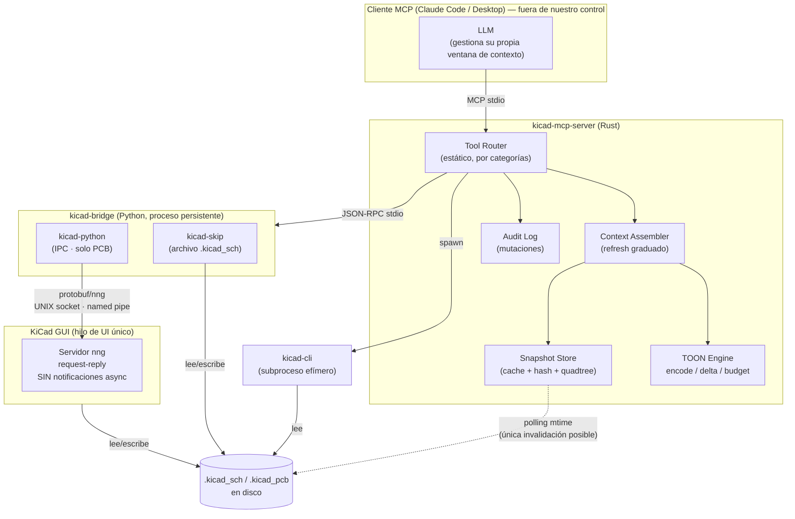
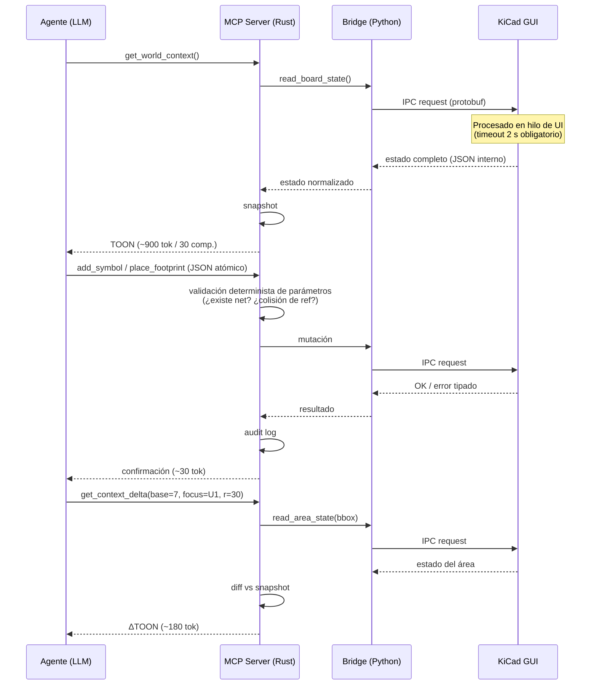

# Arquitectura del sistema: agente de diseño EDA sobre KiCad vía MCP

**Versión:** 0.2 — decisiones de diseño cerradas (P1–P6 resueltas, ver §11)
**Fecha:** Julio 2026
**Estado:** Diseño aprobado para MVP. Las hipótesis S1/S2 siguen pendientes de validación empírica (Evals A/B, §5.8).

---

## 0. Resumen ejecutivo y correcciones a afirmaciones previas

Este documento evalúa críticamente y especifica la arquitectura de un sistema donde un agente LLM opera sobre KiCad mediante un servidor MCP, usando lectura comprimida (formato TOON), escritura mediante herramientas atómicas, y actualización de contexto por delta + área local.

**Veredicto general anticipado:** la arquitectura de comunicación (CQRS: lectura comprimida / escritura por tools) es sólida y factible hoy. La parte débil del sistema no es la ingeniería del servidor: son **dos hipótesis no validadas** — (a) que el formato TOON mejora la comprensión/costo frente a alternativas simples, y (b) que un LLM puede tomar decisiones de diseño electrónico espacial (colocación, ruteo) con calidad útil. La primera es barata de validar; la segunda es una limitación conocida de los modelos actuales y condiciona el alcance realista del producto: **copiloto con validación determinista, no diseñador autónomo end-to-end**.

**Correcciones a afirmaciones hechas en conversaciones previas de este mismo proyecto** (integridad del análisis):

1. **Invalidación de cache por eventos: INVIABLE.** Previamente se propuso que el servidor MCP "escuche eventos de cambio del IPC API de KiCad" para invalidar el cache cuando el usuario edita manualmente. La documentación oficial de KiCad es explícita: el socket IPC opera en modo *request-reply*, con KiCad como servidor, y **las notificaciones asíncronas a clientes API no son posibles actualmente**. La invalidación debe hacerse por *polling* (mtime de archivos + re-lectura de estado), con las race conditions que eso implica. Ver §4.4 y §8.
2. **Remoción de SWIG: fecha corregida.** Se afirmó que los bindings SWIG fueron removidos en KiCad 10. Según la página oficial de kicad-python (PyPI, abril 2026): los bindings SWIG existen aún en KiCad 9 y 10, y **se remueven en KiCad 11**. No afecta la arquitectura (el plan nunca dependió de SWIG), pero sí la ventana de compatibilidad.
3. **Costos de tokens por delta: matiz importante omitido.** Los cálculos previos de ahorro asumían que cada turno "reemplaza" el contexto anterior. En un agente conversacional real (Claude Code, Claude Desktop), los TOON anteriores **permanecen en el historial**: el servidor MCP no controla la ventana de contexto del host. El delta reduce los tokens *nuevos por turno* y se beneficia del prompt caching del proveedor, pero el costo acumulado de sesión lo gobierna el cliente MCP (compaction), no el servidor. Ver §5.6.

---

## 1. Análisis crítico de la idea

### 1.1 Objetivo real del sistema

Declarado: "un agente que diseñe esquemáticos y PCB de manera autónoma".

Objetivo real alcanzable con la tecnología disponible (julio 2026): **un sistema donde un LLM ejecuta operaciones de diseño EDA sobre KiCad con supervisión humana, minimizando costo de tokens y latencia, con validación determinista (ERC/DRC) en el loop.** La palabra "autónoma" debe restringirse a *secuencias de operaciones* autónomas (colocar N componentes, conectar M nets, iterar hasta pasar DRC), no a *diseño autónomo* de circuitos con calidad profesional sin revisión.

### 1.2 Problema que intenta resolver

- El trabajo EDA tiene alta proporción de tareas mecánicas (colocación repetitiva, cableado de buses, generación de fabricación, verificación) que hoy consumen tiempo de ingeniería.
- Los servidores MCP existentes para KiCad (mixelpixx/KiCAD-MCP-Server, oaslananka/kicad-mcp-pro, Seeed-Studio/kicad-mcp-server, lamaalrajih/kicad-mcp) resuelven la *conectividad* pero ninguno ataca sistemáticamente el **costo de contexto**: vuelcan estado extenso al modelo o exponen decenas de tools cuyos schemas consumen la ventana. El diferencial de este proyecto es la economía de tokens (TOON + delta + área local + refresh graduado), no la existencia del puente en sí.

### 1.3 Casos de uso (ordenados por viabilidad, no por atractivo)

| # | Caso de uso | Viabilidad hoy |
|---|---|---|
| U1 | Análisis y Q&A sobre proyecto existente ("¿qué está conectado a PA0?") | Alta |
| U2 | Verificación asistida: correr ERC/DRC, interpretar resultados, proponer fixes | Alta |
| U3 | Generación de fabricación (Gerbers, BOM, STEP) con validación previa | Alta |
| U4 | Ediciones dirigidas de PCB: mover/rotar footprints, crear tracks/vias/zonas puntuales | Alta (vía IPC) |
| U5 | Edición de esquemático: agregar símbolos, valores, conexiones | Media (workaround frágil, ver §8) |
| U6 | Colocación asistida de grupos de componentes (decoupling caps cerca de MCU) | Media, requiere heurísticas deterministas de apoyo |
| U7 | Ruteo autónomo del PCB por el LLM | Baja — delegar a autorouter determinista (Freerouting) |
| U8 | Diseño end-to-end desde especificación en lenguaje natural | No factible con calidad profesional sin humano en el loop |

### 1.4 Usuarios objetivo

**Suposición explícita (no confirmada por el autor del proyecto):** ingenieros/makers individuales usando KiCad de escritorio, un usuario por instancia, ejecución local. Esta suposición condiciona todo el documento (transporte stdio, sin multi-tenancy, seguridad centrada en el host local). **Pregunta abierta P1 (§11):** si el objetivo incluye uso remoto/equipo, cambian transporte, autenticación y el modelo de sesión.

### 1.5 Supuestos implícitos detectados en la propuesta (y su estado)

| Supuesto | Estado | Evidencia |
|---|---|---|
| S1: El LLM lee TOON tan bien como JSON | **No validado.** Hipótesis plausible pero sin benchmark propio. Los formatos tabulares densos funcionan bien en modelos frontera, pero la variante exacta importa. | Requiere eval (§5.8) |
| S2: El LLM mantiene un modelo mental coherente a través de N deltas | **No validado y riesgoso.** El "state drift" es un modo de fallo documentado en agentes de larga duración. | Requiere eval + mitigación (re-sync periódico) |
| S3: KiCad puede notificar cambios al MCP | **Falso.** Request-reply únicamente. | Doc. oficial KiCad |
| S4: El agente puede decidir colocación/ruteo con calidad | **Mayormente falso hoy.** Razonamiento geométrico/espacial es debilidad conocida de LLMs; sin verificador determinista los resultados no son confiables. | Literatura + estado del arte |
| S5: Rust reduce errores del agente codificador | **Parcialmente cierto.** Cierto para errores de memoria/concurrencia/tipos; falso para errores de lógica de dominio, que serán la mayoría. | PLDI 2025 (type-constrained codegen) |
| S6: Una sesión = un proyecto = una instancia de KiCad | Suposición de diseño razonable, debe hacerse explícita en el código (token de instancia KICAD_API_TOKEN). | Doc. oficial |

### 1.6 Riesgos y puntos débiles principales (resumen; detalle en §8)

1. **Dependencia de kicad-skip para escritura de esquemáticos**: librería de terceros, acoplada al formato de archivo, sin garantías; proyectos existentes reportaron el flujo de esquemático "completamente roto" en versiones previas. Es el eslabón más frágil del sistema completo.
2. **Concurrencia humano+agente sobre el mismo proyecto**: sin eventos, sin locks, con KiCad escribiendo desde la GUI y kicad-skip escribiendo el archivo. Riesgo real de corrupción o pérdida de trabajo. El MVP debe imponer *modo exclusivo* documentado.
3. **Bloqueo del hilo de UI de KiCad**: toda request IPC se procesa en el hilo de UI; una operación larga congela la GUI del usuario. Obligatorio: timeouts, operaciones acotadas, batching prudente.
4. **Prompt injection vía archivos de diseño**: nombres de nets, campos de símbolos, textos de silkscreen son datos no confiables que terminan dentro del contexto del modelo. Un proyecto malicioso puede contener instrucciones. Ver §7.
5. **La economía de tokens depende del cliente MCP**: sin compaction del lado del host, el ahorro por delta es menor al proyectado (§5.6).

---

## 2. Requisitos

### 2.1 Funcionales

| ID | Requisito | Prioridad |
|---|---|---|
| RF1 | Exponer servidor MCP por stdio compatible con spec 2025-11-25 (tools, resources, prompts) | MVP |
| RF2 | `get_world_context`: estado del proyecto serializado a TOON con presupuesto de tokens configurable | MVP |
| RF3 | `get_context_delta(base_snap, focus_ref, radius)`: ΔTOON de área local contra snapshot cacheado | v0.3 |
| RF4 | Tools atómicas de PCB vía IPC: place/move/rotate footprint, add track/via/zone, asignación de nets, grupos | v0.2 |
| RF5 | Tools atómicas de esquemático (add_symbol, set_value, connect) sobre archivo (.kicad_sch) | v0.2 (experimental) |
| RF6 | Validación: ERC/DRC headless vía kicad-cli con resultados estructurados y filtrados | MVP |
| RF7 | Exportación: Gerber, drill, BOM, netlist, STEP, PDF, render | MVP |
| RF8 | Refresh graduado: confirmación (~30 tok) / delta (~150–200) / full (~900 para 30 comp.) | v0.3 |
| RF9 | Descubrimiento de tools por categoría para no cargar todos los schemas por turno | v0.2 |
| RF10 | Detección de mutación externa (usuario editó a mano) e invalidación de snapshots por polling | v0.3 |
| RF11 | Recarga del documento en la GUI tras edición de archivo (donde el IPC lo permita) | v0.2 |
| RF12 | Registro auditable de toda mutación ejecutada (quién=agente, qué, cuándo, parámetros) | MVP |

### 2.2 No funcionales

| ID | Requisito | Métrica objetivo | Comentario crítico |
|---|---|---|---|
| RNF1 | Latencia del servidor (excluyendo KiCad y LLM) | p95 < 20 ms por tool call | Trivial de cumplir; el cuello es KiCad UI thread y el roundtrip LLM (800–3000 ms). Optimizar el servidor más allá de esto es esfuerzo desperdiciado. |
| RNF2 | Presupuesto de contexto | ≤ 1.000 tokens de contexto nuevo por turno en proyectos ≤ 50 componentes | Depende de S1/S2; medible desde el MVP con logging de tokens estimados. |
| RNF3 | Robustez ante KiCad caído/reiniciado | Reconexión automática; detección por KICAD_API_TOKEN; errores tipados al agente | El token cambia por instancia: úsese para detectar reinicios a mitad de sesión. |
| RNF4 | Nunca congelar la GUI de KiCad > 2 s | Timeout por request IPC (configurable, default 2000 ms) + operaciones acotadas | Restricción dura impuesta por el diseño de KiCad. |
| RNF5 | Mantenibilidad | Core desacoplado de la capa KiCad mediante trait/interfaz mockeable; cobertura de tests del motor TOON/delta > 90 % (es lógica pura) | |
| RNF6 | Portabilidad | **Linux únicamente** (decisión D5). Unix socket `/tmp/kicad/api.sock`. macOS: probablemente funcional (mismo mecanismo), sin CI → no soportado oficialmente. Windows: eliminado del roadmap. | Resuelto por P5. |
| RNF7 | Escalabilidad | **Fuera de alcance deliberado**: sistema mono-usuario local. | Ver §6: "escalar" aquí significa proyectos grandes (500+ componentes), no usuarios concurrentes. |

---

## 3. Arquitectura de alto nivel

### 3.1 Decisión de stack (justificada, con alternativa descartada explícita)

**Decisión:** núcleo del servidor en **Rust** (protocolo MCP con `rmcp` 0.16+, motor TOON, cache de snapshots, índice espacial) + **bridge Python persistente** (kicad-python para IPC de PCB; kicad-skip para archivo de esquemático) + **kicad-cli** como subproceso para exportación/validación.

**Justificación:** (a) el binding oficial y mantenido del IPC de KiCad es Python; el binding Rust es experimental y su propio autor declara que no puede mantenerlo — reimplementar nng+protobuf en Rust es deuda de mantenimiento contra los .proto de KiCad; (b) la lógica que realmente se beneficia del sistema de tipos (delta, cache concurrente, serialización) vive en Rust; (c) la latencia añadida por el bridge (JSON-RPC por stdio, 2–5 ms) es despreciable frente a los 50–500 ms del hilo de UI de KiCad.

**Alternativa descartada:** todo-Python (FastMCP). Es la vía más rápida (y es la recomendación para el MVP, ver §10), pero como arquitectura final pierde las garantías de tipos en el subsistema con más lógica propia. **Advertencia honesta:** si el equipo es de una sola persona, mantener dos runtimes tiene un costo real de packaging y debugging; la decisión Rust+Python solo se justifica si el proyecto supera la fase de validación. No adoptar Rust "porque protege del agente codificador": protege de una clase de errores, no de errores de dominio (S5).

### 3.2 Diagrama de componentes

### 3.3 Flujo de datos del loop percepción-acción

### 3.4 Tabla de componentes y dependencias

| Componente | Lenguaje | Depende de | Estado de la dependencia | Reemplazable por |
|---|---|---|---|---|
| MCP core (`rmcp`) | Rust | rmcp 0.16+ (SDK oficial) | Estable, activo | rust-mcp-sdk (100 % conformance) |
| TOON Engine | Rust | serde; sin deps externas | Propio | — |
| Snapshot Store | Rust | dashmap, rstar (quadtree/R-tree) | Estables | — |
| Bridge PCB | Python | kicad-python 0.7.x | **Oficial pero joven** (0.x, breaking changes probables) | binding Rust nng (experimental, NO recomendado) |
| Bridge esquemático | Python | kicad-skip | **Tercero, frágil** — riesgo #1 del sistema | Parser S-expression propio (más control, más trabajo) |
| Validación/exports | — | kicad-cli (binario oficial) | Estable | IPC API en KiCad 11 (aún no liberado como estable a julio 2026) |
| Cliente MCP | — | Claude Code / Desktop / Cursor… | Fuera de control | — |

---

## 4. Arquitectura interna por componente

### 4.1 Tool Router (Rust)

**Entradas:** requests MCP (`tools/list`, `tools/call`). **Salidas:** resultados MCP tipados.
**Diseño:** registro estático vía macros `#[tool]`; agrupación en categorías (`world`, `schematic`, `pcb`, `validate`, `export`, `library`). `tools/list` devuelve por defecto solo `world` + `validate` + un tool `discover_tools(category)`; el resto se materializa bajo demanda. Justificación: los proyectos existentes demostraron que exponer 100+ schemas simultáneos es prohibitivo en tokens (mixelpixx/MJP-Sys migró a router por categorías por esta razón).
**Regla dura:** las descripciones de tools son compactas (≤ 15 palabras) y estables durante toda la sesión — cambiar descripciones a mitad de sesión degrada la selección de tools del modelo.
**Validación previa:** todo parámetro se valida determinísticamente contra el snapshot vigente antes de tocar KiCad (referencia inexistente, net inexistente, coordenadas fuera del board). El error vuelve tipado: `{code: "NET_NOT_FOUND", hint: "nets similares: 3V3, 3V3_MCU"}`. Nunca se propaga un traceback de Python ni un error protobuf crudo al modelo.

### 4.2 TOON Engine (Rust)

**Entradas:** estado normalizado (structs tipados). **Salidas:** string TOON completo o ΔTOON.
**Contrato del formato (v1):** cabecera con versión/contadores/snapshot; secciones `[C]` (componentes: ref, value, clase funcional, x, y, mapa pin→net) y `[N]` (nets: net → lista de pines); delta con marcadores `[+] [-] [~]` y contexto del área. El formato lleva **número de versión en la cabecera**: es un contrato con el prompt del agente y debe evolucionar versionado.
**Presupuesto de tokens:** el encoder recibe `max_tokens`; si el estado excede el presupuesto, degrada en orden: (1) omite posiciones de componentes fuera del foco, (2) colapsa nets de poder a conteos (`GND: 47 pines`), (3) reemplaza componentes lejanos por resúmenes de bloque funcional. La estimación de tokens es aproximada (chars/3.5 para este tipo de contenido) — suficiente para presupuestar, no para facturar.
**No especulativo pero no validado:** la elección exacta de sintaxis TOON vs. CSV vs. YAML compacto debe decidirse con la eval de §5.8, no por estética.

### 4.3 Snapshot Store + índice espacial (Rust)

**Estructura:** `DashMap<SnapId, Snapshot>` con LRU (retener ~8 snapshots); cada snapshot lleva hash del estado, mtimes de los archivos fuente y un R-tree (`rstar`) de componentes para queries `bbox(focus, radius)` en O(log n + k).
**Gestión de estado:** el snapshot es **la fuente de verdad del delta**, nunca el historial del LLM. `get_context_delta` sin `base_snap` válido (expirado, invalidado) responde con error tipado `SNAPSHOT_STALE` instruyendo al agente a pedir contexto completo — el servidor jamás "adivina" un delta.

### 4.4 Invalidator (polling — la única opción real)

Dado que KiCad no emite notificaciones (corrección #1 del §0), la detección de ediciones manuales del usuario se hace por: (a) mtime/watcher (`notify` crate) sobre `.kicad_pcb`/`.kicad_sch`; (b) verificación barata previa a cada delta (comparar conteos/hash de área con el snapshot). **Limitación explícita e irresoluble hoy:** entre polls existe una ventana donde agente y humano editan concurrentemente; KiCad GUI además mantiene estado en memoria no volcado a disco. **Mitigación de MVP: modo exclusivo documentado** — mientras el agente opera, el usuario no edita; el servidor detecta la violación *a posteriori* y fuerza re-sync, no puede prevenirla. Clasificado en §9 como "no factible actualmente" en su forma segura.

### 4.5 kicad-bridge (Python persistente)

**Proceso hijo** del servidor Rust, vivo toda la sesión; JSON-RPC 2.0 por stdio; supervisión con reinicio automático y backoff; healthcheck cada 30 s. Contrato de mensajes versionado y validado en ambos lados (serde en Rust, pydantic en Python) — el punto de integración entre dos runtimes es donde un agente codificador introduce errores silenciosos, por eso el contrato se testea con golden files compartidos.
**Manejo del hilo de UI de KiCad:** cola interna de profundidad 1 (las requests IPC son secuenciales de todos modos); timeout por request; si KiCad no responde, el bridge marca la conexión sospechosa y verifica KICAD_API_TOKEN para distinguir "ocupado" de "reiniciado".

### 4.6 Almacenamiento y persistencia

Sin base de datos en el MVP y probablemente nunca: el estado canónico vive en los archivos KiCad; los snapshots son efímeros en memoria; el audit log es JSONL rotativo en el directorio del proyecto (`.kicad-mcp/audit.jsonl`). Añadir una BD sería complejidad sin requisito que la justifique. **Suposición explícita:** no se requiere historial multi-sesión consultable; si se requiriera (pregunta P6), SQLite embebido es suficiente.

### 4.7 Colas y asincronía

Tokio en el core; una sola cola serializada hacia el bridge (respeta el hilo único de KiCad); kicad-cli en subprocesos paralelos permitidos (no tocan el socket IPC, leen archivos) con límite de 2 concurrentes para no competir por disco. No hay message broker: sería sobre-ingeniería para un proceso local mono-usuario.

---

## 5. Arquitectura de IA

### 5.1 Modelos

El sistema es **agnóstico del modelo** por diseño (cualquier cliente MCP), pero el diseño del contexto está calibrado para modelos frontera con tool use fuerte (familia Claude, GPT). **Suposición explícita:** modelos vía API de nube; no hay requisito de inferencia local. Ejecutar esto sobre un modelo local pequeño (≤ 14B) es previsiblemente insuficiente para la parte de razonamiento EDA — no se recomienda ni se soporta como objetivo.

### 5.2 Razonamiento y orquestación

Un solo agente con loop ReAct gestionado por el cliente MCP (Claude Code): el servidor **no orquesta** al agente, expone herramientas y contexto. Decisión deliberada: mover la orquestación al servidor (planner propio, multi-agente) multiplicaría la complejidad sin evidencia de necesidad. El "plan" vive en el razonamiento del modelo; el servidor aporta *guardrails deterministas* (validación de parámetros, gates de DRC antes de export).

### 5.3 Memoria

Tres niveles, con responsabilidades separadas:
1. **Ventana del LLM** — la gobierna el cliente, no nosotros (ver 5.6).
2. **Snapshot Store** — memoria de estado del mundo, autoritativa para deltas.
3. **Resumen de sesión opcional** (`get_session_summary`): lista compacta de mutaciones aplicadas desde el inicio (del audit log, determinista, ~10 tok/operación). Sirve como re-anclaje cuando el cliente compacta el historial: el agente puede reconstruir "qué hice" sin releer todo el mundo.

### 5.4 RAG

**Fuera del alcance del núcleo.** Tentaciones previsibles: indexar datasheets, librerías de símbolos, reglas de diseño. Cada una es un subsistema completo (ingesta de PDF, embeddings, chunking). La arquitectura deja el enganche (un tool `search_library(query)` contra el índice de librerías KiCad instaladas, que es búsqueda léxica determinista, no RAG) y pospone datasheets a post-v1. Marcar como "factible con investigación adicional" — no porque la técnica no exista, sino porque su costo/beneficio aquí no está demostrado.

### 5.5 Herramientas: separación determinista/LLM (crítica a la tentación inversa)

Regla de diseño: **si es calculable, no llega al modelo.** Traversal de netlist, vecindad espacial, conteos, diffs, validaciones, ERC/DRC: servidor. El LLM decide solo donde hay juicio (elección de componente, topología, interpretación de violaciones DRC, trade-offs). El anti-patrón observado en servidores existentes es el inverso: preguntar al modelo cosas que el servidor sabe. Cada una de esas preguntas cuesta un roundtrip (~1–3 s y tokens) y añade probabilidad de error.

Complemento necesario para U6/U7 (colocación/ruteo): **primitivas deterministas de apoyo** — `suggest_positions(ref, strategy="decoupling")` calcula posiciones válidas por heurística geométrica y el LLM elige entre ellas; el ruteo se delega a Freerouting (integración probada por proyectos existentes) con el LLM configurando restricciones y evaluando el resultado vía DRC. Esto convierte problemas donde el LLM es débil (geometría continua) en problemas donde es fuerte (selección discreta y evaluación).

### 5.6 Economía de tokens: el análisis honesto

Lo que el servidor controla: tokens nuevos por turno (contexto TOON/delta, schemas de tools visibles, tamaño de confirmaciones). Lo que NO controla: la acumulación del historial en la ventana del cliente. Implicaciones:

- El ahorro real por turno con prompt caching del proveedor: el historial previo se re-procesa a precio de cache (~10 % del precio de input en la API de Anthropic); los tokens nuevos pagan precio completo. Minimizar tokens nuevos sigue siendo la palanca correcta, pero el ROI proyectado debe calcularse con caching, no contra re-envío completo.
- Un TOON completo de 900 tokens emitido 10 veces contamina la ventana con ~9.000 tokens aunque cada emisión fuera "barata": el refresh graduado importa tanto por higiene de ventana (atención del modelo) como por costo.
- Presupuesto de referencia por sesión (30 componentes, 20 operaciones, precios API julio 2026, orden de magnitud): 60–120 k tokens de input acumulado con caching efectivo, 12–15 k de output → **~USD 0,25–0,60/sesión** con un modelo frontera. Estimación, no promesa; el logging de RNF2 existe para medirlo.

### 5.7 Hardware

Servidor + bridge: < 200 MB RAM, CPU marginal; corre en cualquier máquina que corra KiCad. No hay GPU ni entrenamiento. El costo computacional relevante es 100 % API del LLM.

### 5.8 Evaluación (la parte que casi todos los proyectos similares omiten)

Sin esto, las hipótesis S1/S2 quedan sin base:
- **Eval A (formato):** mismo conjunto de 30–50 preguntas de comprensión de netlist ("¿qué pines de U1 quedan sin conectar?") contra el mismo proyecto serializado en: JSON compacto, CSV, TOON v1. Métrica: exactitud y tokens. Barata (un script, ~200 llamadas).
- **Eval B (delta drift):** secuencias sintéticas de 10–30 operaciones con deltas; al final, preguntas de estado global. Métrica: divergencia entre el estado real y lo que el modelo cree. Define la política de re-sync completo (cada N deltas).
- **Eval C (end-to-end):** tareas cerradas tipo "añadí desacoplo a todos los ICs y pasá DRC" con criterio de éxito verificable por DRC/netlist. Es el único benchmark que mide el sistema y no las partes.

---

## 6. Escalabilidad (redefinida honestamente)

Este es un proceso local mono-usuario: balanceo de carga, réplicas y disaster recovery **no aplican** y fingirlos sería teatro arquitectónico. Las dimensiones reales de escala:

| Dimensión | Límite práctico | Estrategia |
|---|---|---|
| Tamaño de proyecto | ~500–1000 componentes antes de que el TOON completo sea inviable como contexto | Área local por defecto + resúmenes de bloque funcional + contexto bajo demanda (`get_component_detail`) |
| Profundidad de sesión | Ventana del cliente (~200 k tok) | Refresh graduado + `get_session_summary` para sobrevivir compactions |
| Throughput de mutaciones | Serializado por el hilo de UI de KiCad (decenas/s como techo, no miles) | Batching en tools compuestos (`add_symbols[]`) donde el IPC lo permita |
| Puntos de fallo | KiCad GUI (crash/reinicio), bridge Python, archivo corrupto por edición concurrente | Reconexión + KICAD_API_TOKEN; supervisor del bridge; backups automáticos previos a sesión de mutación (copiar .kicad_sch/.kicad_pcb a .kicad-mcp/backups/) |
| Recuperación | Git como mecanismo primario recomendado al usuario; backups locales como red secundaria | El servidor puede ofrecer `checkpoint()` que hace commit si el proyecto está bajo git |

Cuello de botella #1 permanente: el roundtrip del LLM. Cuello #2: el hilo de UI de KiCad. Todo lo demás es ruido de medición.

---

## 7. Seguridad

Modelo de amenaza realista para una herramienta local de escritorio con un agente dentro:

| Vector | Riesgo | Mitigación |
|---|---|---|
| **Prompt injection vía archivos de diseño** (nombres de nets/campos/textos con instrucciones; proyectos descargados de internet) | Alto y específico de este dominio | Sanitizar/escapar todo texto proveniente del proyecto al serializar TOON; longitud máxima por campo; el prompt del sistema debe declarar el TOON como datos, no instrucciones. No elimina el riesgo (ninguna mitigación lo hace hoy), lo reduce. |
| Mutaciones destructivas del agente | Alto | Audit log (RF12); backups pre-sesión; gates: `export_manufacturing` exige DRC limpio; tools destructivos (delete masivo) requieren confirmación explícita del usuario vía elicitation del cliente MCP. |
| Path traversal / escritura arbitraria | Medio | Raíz de proyecto declarada al inicio; toda ruta se canonicaliza y valida contra esa raíz; kicad-cli se invoca con argumentos construidos (nunca shell interpolado). |
| Socket IPC de KiCad accesible a otros procesos locales | Bajo (mismo usuario del SO) | Fuera de nuestro control (diseño de KiCad); documentar. KICAD_API_TOKEN identifica instancia, no autentica. |
| Transporte remoto | N/A en MVP | stdio local únicamente. Si P1 exige remoto: Streamable HTTP + OAuth 2.1 conforme spec MCP jun-2025 — trabajo no trivial, tratarlo como proyecto aparte. |
| Secretos | Casi nulos | El servidor no maneja claves de LLM (las tiene el cliente). Config sin secretos. |

---

## 8. Riesgos técnicos (registro explícito)

| # | Riesgo | Prob. | Impacto | Mitigación / plan B |
|---|---|---|---|---|
| R1 | kicad-skip insuficiente para escritura robusta de esquemáticos (wires/junctions válidos, sheets jerárquicos) | Alta | Alto — bloquea la mitad "esquemático" | Parser S-expression propio con golden tests contra KiCad real; limitar operaciones soportadas; esperar IPC schematic API (anunciada, sin fecha estable) |
| R2 | Breaking changes en kicad-python 0.x / .proto de KiCad entre versiones | Media | Medio | Pin de versión; matriz de CI contra KiCad 9/10; capa de adaptación en el bridge |
| R3 | Drift de estado con deltas (S2) | Media | Alto — errores silenciosos de diseño | Eval B; re-sync forzado cada N deltas; verificación determinista de parámetros contra snapshot en cada mutación (ya diseñada) |
| R4 | Edición concurrente humano+agente corrompe trabajo | Media | Alto | Modo exclusivo + detección a posteriori + backups; no hay solución completa sin soporte de KiCad (eventos/locks) |
| R5 | Congelamiento de GUI por requests largas | Media | Medio (percepción de calidad) | Timeouts duros, operaciones acotadas, nunca loops de polling contra el IPC |
| R6 | Complejidad de dos runtimes (Rust+Python) para un equipo pequeño | Media | Medio | MVP en Python puro; migrar a Rust solo tras validación (roadmap §10) |
| R7 | TOON no rinde mejor que un formato trivial (S1) | Media | Bajo (se reemplaza el encoder, la arquitectura sobrevive) | Eval A antes de invertir en el encoder sofisticado |
| R8 | El diferencial del proyecto se comoditiza (los 4 proyectos OSS existentes avanzan rápido) | Media | Estratégico | El diferencial defendible es la disciplina de contexto + evals, no el puente; publicar evals |

---

## 9. Matriz de viabilidad

| Capacidad | Clasificación | Nota |
|---|---|---|
| Servidor MCP stdio con tools/resources/prompts (Rust o Python) | **Factible hoy** | SDKs maduros |
| Mutaciones de PCB vía IPC (footprints, tracks, vias, zonas, nets, DRC) | **Factible hoy** | KiCad 9/10, GUI corriendo |
| Lectura de esquemático (parse .kicad_sch) | **Factible hoy** | kicad-skip o parser propio |
| ERC/DRC/exports headless (kicad-cli) | **Factible hoy** | Estable |
| TOON + presupuesto de tokens + refresh graduado | **Factible hoy** (ingeniería propia) | Eficacia sin validar → Eval A/B |
| Cache de snapshots + delta + índice espacial | **Factible hoy** | Lógica pura |
| Escritura robusta de esquemáticos por archivo | **Experimental** | R1; el punto más frágil |
| IPC headless (kicad-cli api-server) | **Experimental** | Anunciado para KiCad 11; a julio 2026 solo en desarrollo/nightlies |
| IPC API para editor de esquemáticos | **No disponible aún** | Anunciado sin fecha estable; rediseñaría la mitad frágil del sistema cuando llegue |
| Notificaciones asíncronas desde KiCad | **No factible actualmente** | Limitación de diseño de KiCad (request-reply) |
| Edición concurrente segura humano+agente | **No factible actualmente** | Requiere soporte de KiCad inexistente |
| Colocación asistida (heurísticas + selección LLM) | **Factible con investigación** | Requiere primitivas deterministas + Eval C |
| Ruteo autónomo por LLM | **No factible con calidad hoy** | Delegar a Freerouting; LLM como configurador/evaluador |
| Diseño end-to-end autónomo con calidad profesional | **No factible actualmente** | El sistema honesto es un copiloto con gates deterministas |

---

## 10. Roadmap

**MVP (4–6 semanas, Python + FastMCP):** solo lectura + validación + exports. `get_world_context` (TOON v1 con presupuesto), Q&A de netlist, ERC/DRC estructurado, Gerber/BOM/STEP, audit log, logging de tokens. *Criterio de salida:* Eval A ejecutada; U1–U3 funcionando de punta a punta con Claude Code. Razón para empezar sin mutaciones: valida el 80 % de las hipótesis de contexto con el 20 % del riesgo.

**v0.2 (4–6 semanas):** mutaciones de PCB vía kicad-python (categorías de tools, validación determinista de parámetros, confirmaciones ligeras, backups pre-sesión, reload en GUI). Esquemático de escritura **detrás de un flag experimental** con el subconjunto que kicad-skip soporte de forma demostrable (golden tests).

**v0.3 (4 semanas):** delta + área local + invalidator por polling + refresh graduado + `get_session_summary`. Eval B; fijar política de re-sync.

**v0.4 (4–6 semanas, condicional a que el proyecto siga vivo y duela el rendimiento/mantenibilidad):** port del core a Rust (rmcp) con bridge Python; Freerouting + `suggest_positions`; hardening del sistema de gates con lo aprendido en v0.2/v0.3. Eval C.

**v1.0 (condicional externo):** adopción del IPC schematic API de KiCad cuando exista en versión estable, retirando kicad-skip. Fecha fuera de nuestro control — el roadmap debe decirlo en voz alta.

---

## 11. Registro de decisiones (P1–P6 resueltas)

### D1 (P1) — Mono-usuario local, definitivo
stdio es el único transporte. OAuth 2.1 y Streamable HTTP se **eliminan** del backlog (no "diferidos": un backlog fantasma distorsiona decisiones futuras). La superficie de seguridad queda reducida a la fila 1–4 de la tabla del §7. Consecuencia arquitectónica: el Snapshot Store nunca necesita ser compartido ni serializable entre procesos.

### D2 (P2) — KiCad 10 como objetivo primario, 9.0 como mínimo best-effort
Justificación: KiCad 10 (feb 2026) es la versión estable vigente, con más de un año de maduración del IPC API sobre lo liberado en 9.0; KiCad 9 sigue ampliamente instalado y kicad-python soporta 9+, por lo que mantenerlo como mínimo cuesta poco (matriz de CI 9/10). **Regla dura:** ninguna feature del sistema puede depender de KiCad 11/nightlies (headless api-server, exports vía IPC, schematic IPC) — esas capacidades se tratan como mejoras oportunistas cuando 11 sea estable (~feb 2027 según cadencia anual), momento en que se re-evalúa el retiro de kicad-skip (roadmap v1.0).

### D3 (P3) — Autonomía con gates
El agente ejecuta mutaciones sin aprobación por operación. La intervención humana se concentra en cinco gates, tres automáticos y dos interactivos:

| Gate | Disparador | Tipo | Acción |
|---|---|---|---|
| G1 | Inicio de sesión de mutación | Automático | Backup de `.kicad_sch`/`.kicad_pcb` a `.kicad-mcp/backups/`; si el proyecto está bajo git, commit checkpoint |
| G2 | Operación destructiva: borrado de >5 ítems, sobrescritura de archivos, modificación de design rules | **Interactivo** | Elicitation al usuario vía cliente MCP; sin confirmación → rechazo tipado `GATE_DENIED` |
| G3 | `export_manufacturing` | Automático (determinista) | Bloqueado si ERC/DRC reportan violaciones de severidad error; el agente recibe la lista y debe resolverlas — no hay override por prompt |
| G4 | Presupuesto de sesión: techo de operaciones (default 200) y de tokens estimados emitidos (default 150 k) | **Interactivo** | `BUDGET_EXCEEDED`; continuar requiere acción explícita del usuario |
| G5 | Invalidator detecta edición externa (mtime) | Automático | Mutaciones pausadas; se fuerza re-sync completo antes de continuar |

Diseño deliberado: los gates son **inviolables desde el prompt** — viven en el servidor, no en las instrucciones del modelo, precisamente por el riesgo de prompt injection del §7.

### D4 (P4) — Calibración para costo mínimo sin pérdida de contexto
Defaults del MVP (todos configurables, todos medibles vía el logging de RNF2):

- Refresh por defecto tras mutación: **confirmación (~30 tok)**. Delta solo si la operación cambió conectividad o falló. Full solo bajo demanda, tras DRC/ERC, o forzado cada `re_sync_interval = 10` deltas (valor provisional hasta Eval B — es el parámetro que protege contra el drift S2, la "pérdida de contexto" que preocupa).
- Presupuesto TOON: **800 tokens** por contexto completo, con degradación automática por bloques funcionales (§4.2).
- Tools visibles por defecto: **6–8** (categorías `world` + `validate` + `discover_tools`); el resto bajo demanda.
- Schemas y descripciones de tools **inmutables durante la sesión** y contexto con prefijos estables → maximiza el hit-rate del prompt caching del proveedor, que es la palanca de costo más grande que no controlamos directamente.
- Confirmaciones sin eco de parámetros (el modelo ya los emitió; repetirlos es costo puro).
- Métrica de éxito: **≤ 400 tokens nuevos promedio por operación** en proyectos ≤ 50 componentes. Si la medición del MVP no lo cumple, se recalibra con datos, no con intuición.

### D5 (P5) — Linux como única plataforma
Sistema del usuario: Linux. Se soporta exclusivamente Unix socket. Elimina del proyecto: named pipes, packaging dual para Windows, y una dimensión entera de la matriz de CI. macOS queda "posiblemente funcional, no soportado". Esta decisión recorta ~2–3 semanas del roadmap original.

### D6 (P6) — Sin base de datos
Se confirma el diseño del §4.6: audit log JSONL rotativo + backups en `.kicad-mcp/`. El historial multi-sesión consultable no tiene caso de uso que lo justifique hoy; si aparece, la vía es SQLite embebido y la migración es trivial (el JSONL es la fuente). Decisión guiada por YAGNI: cada pieza de infraestructura sin requisito es superficie de mantenimiento para un equipo de una persona.

---

*Fin del documento. Todo número de tokens/costo es estimación de orden de magnitud pendiente de medición con el logging definido en RNF2; toda afirmación sobre KiCad proviene de documentación oficial verificada a julio 2026. Con P1–P6 resueltas, el diseño queda cerrado para iniciar el MVP (§10); las únicas incógnitas restantes son empíricas (Evals A/B/C).*
